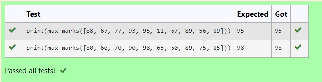
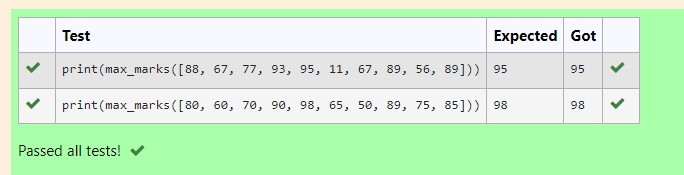
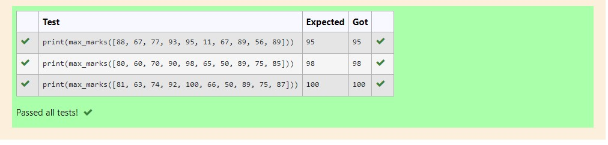

# Find the maximum of a list of numbers
## Aim:
To write a program to find the maximum of a list of numbers.
## Equipment’s required:
1.	Hardware – PCs
2.	Anaconda – Python 3.7 Installation / Moodle-Code Runner
## Algorithm:
1.	Get the list of marks as input.
2.	Use the sort() function or max() function or use the for loop to find the maximum mark.
3.	Return the maximum value.
## Program:

i)	# To find the maximum of marks using the list method sort.
~~~
def max_marks(marks):
    marks.sort()
    max=marks[-1]
    return max
~~~

ii)	# To find the maximum marks using the list method max().
~~~
def max_marks(marks):
    maxi=max(marks)
    return maxi
~~~
iii) # To find the maximum marks without using builtin functions.
~~~
def max_marks(list1):
    maximum=0
    for i in list1:
        if i>maximum:
            maximum=i
    return maximum
~~~

## Output:
 
 
 
## Result:
Thus the program to find the maximum of given numbers from the list is written and verified using python programming.